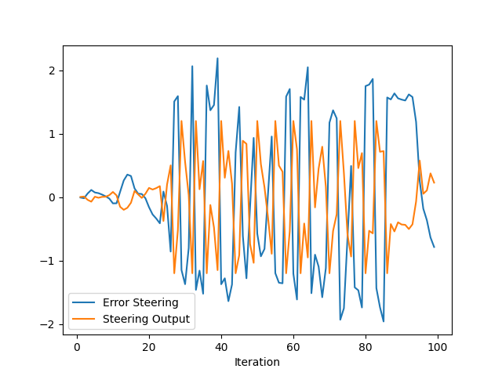

# Project Writeup

__The results are shown below are using optimal throttle PID parameters and varying steer parameters.__

## Only Kp = 0.3 Results:

Only using Kp for steering results in broad errors that switch from steering left to right and the error magnitudes remain almost constant.

## Kp = 0.28 small Ki = 0.7 results:

Using Kp and Ki results in smaller error magnitudes in some cases and the ego car almost completed the entire trajectory without collisions. 

## Kp = 0.28, Kd = 0.005, and Ki = 0.50 results:

Finally, using all three Kp, Ki, and Kd values produces relatively small magnitude for steering error and these particular gain values resulted in a smoother more gradual steering direction change during most of the drive time. 
## Best Parameters Results:

### What is the effect of the PID according to the plots, how each part of the PID affects the control command?

The proportional part corresponds to directly the error value itself and produces a harmonic type signal, changing the steer value by constants amounts either left or right producing a jittery zig-zag pattern. 

The integral part continually sums up the error, both positive and negative errors, over time which removes the constant errors in the system and allows the error to reach zero. However, just a PI controller might tend to produce an overshoot that then has to be corrected.

The derivative part responds to the rate of change of the error and it minimizes the overshoot by slowing the correction applied as the goal value is reached.

Overall, the PID controller helps to continually correct the steer and throttle output to reach the goal values which are also changing with time. 

### How would you design a way to automatically tune the PID parameters?
I would use an algorithm like Twiddle to adjust the PID gains through iterations or until the sum of the gains' change values is very small. Twiddle would be implemented in the `main` loop and call upon the `PID_controller` functions in order to update/calculate the error. 

### PID controller is a model free controller, i.e. it does not use a model of the car. Could you explain the pros and cons of this type of controller?

A Model-Free-Controller allows the use of a control for a plant without using its dynamical model. This proves useful if the dynamic model is unknown and it proves useful in tuning the controller. MFC can be applied to many devices or machines to reduce error. 

However, without a model, the tuning of parameters may take many attempts and guessing whereas with a model, finding the optimal parameters would be a matter of finding a solution to equations. 